# Yolingo - Araç Kiralama Sistemi

Bu proje, Python ve Flask kullanılarak geliştirilmiş modern bir araç kiralama web uygulamasıdır. Kullanıcıların kolayca araç kiralayabileceği, yöneticilerin ise tüm süreci takip edebileceği kapsamlı bir sistem sunar.


## ℹ️ Proje Hakkında ve Önemli Notlar

Bu çalışma, **veritabanı bağlantısı ve yönetimi** konularını pekiştirmek amacıyla hazırlanmış bir **Veritabanı Dersi Ödev Projesi** örneğidir.

**⚠️ Önemli Not:** Eğitim amaçlı geliştirildiği için bazı eksiklikler bulunabilir. Bu repoyu bir referans kaynağı olarak kullanabilir, kodları inceleyerek kendi fikirlerinizi ve çözümlerinizi projenize entegre edebilirsiniz.

---

## 🌟 Özellikler


### 👤 Müşteri Paneli
*   **Kolay Kiralama:** Şehir, tarih ve saat seçimi ile hızlı rezervasyon oluşturma.
*   **Gelişmiş Filtreleme:** Vites tipi, yakıt türü ve fiyat aralığına göre araç arama.
*   **Otomatik Fiyatlandırma:** Gün sayısı ve seçilen ekstra sigorta paketlerine göre anlık fiyat hesaplama.
*   **Kullanıcı Hesabı:** Geçmiş kiralamaları görüntüleme ve profil yönetimi.
*   **PDF Sözleşme:** Kiralamalara ait resmi sözleşmeyi tek tıkla PDF olarak indirme.
*   **Güvenli Ödeme:** Kredi kartı ile sanal ödeme simülasyonu.


### 🛡️ Yönetici (Admin) Paneli
*   **Gelişmiş Dashboard:** Anlık ciro, aktif kiralama, araç doluluk oranları ve grafiksel analizler (Chart.js).
*   **Araç Yönetimi:** Yeni araç ekleme, resim yükleme, bakım ve sigorta takibi.
*   **Kiralama Takvimi:** Tüm kiralamaları etkileşimli bir takvim üzerinde (FullCalendar) görüntüleme.
*   **Rezervasyon Yönetimi:** Gelen kiralamaları onaylama, iptal etme veya aracı teslim alma işlemleri.
*   **Bakım Takibi:** Araçların servis ve bakım geçmişini kaydetme.
*   **Yorum Yönetimi:** Müşteri yorumlarını onaylama veya reddetme.


---

## 📸 Ekran Görüntüleri

| | |
|:---:|:---:|
| **Kayıt Olma Sayfası** <br> 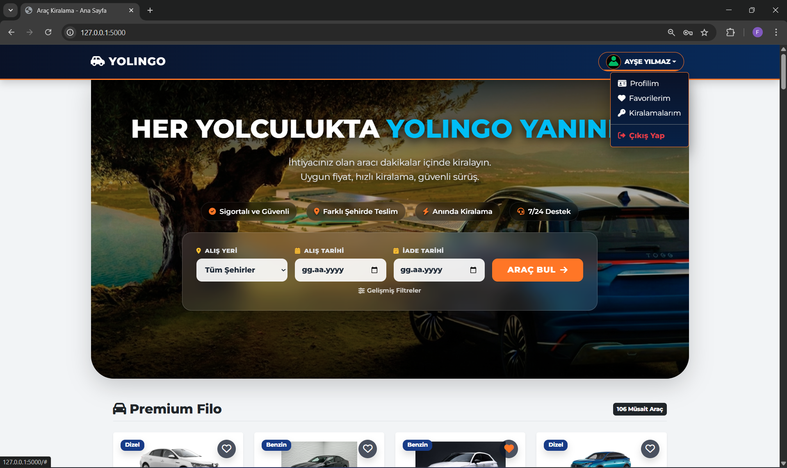 | **Giriş Yapma Sayfası** <br> 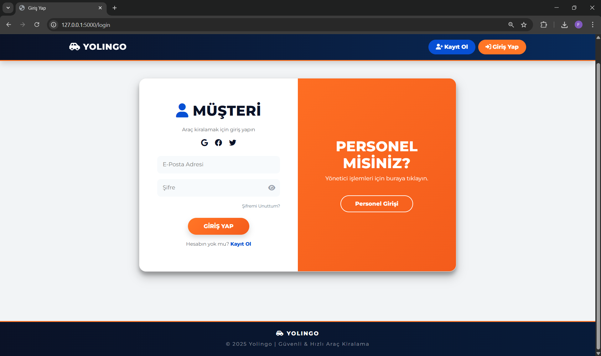 |
| **Anasayfa** <br>  | **Kirada Olmayan Araçlar (Liste)** <br> 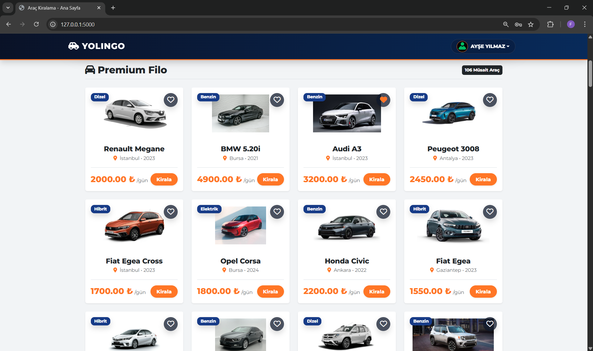 |
| **Kiralama Sayfası** <br> 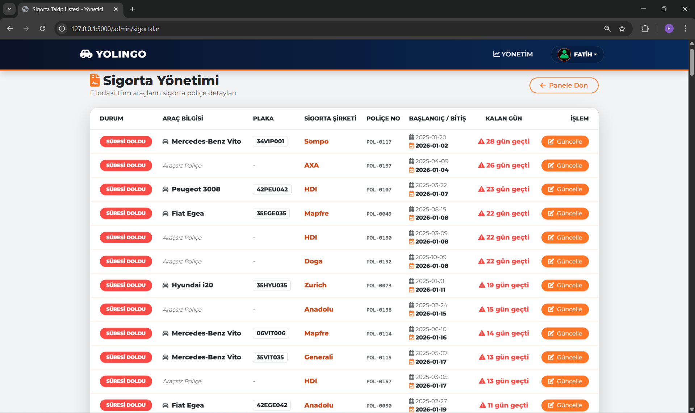 | **Ödeme Sayfası** <br> 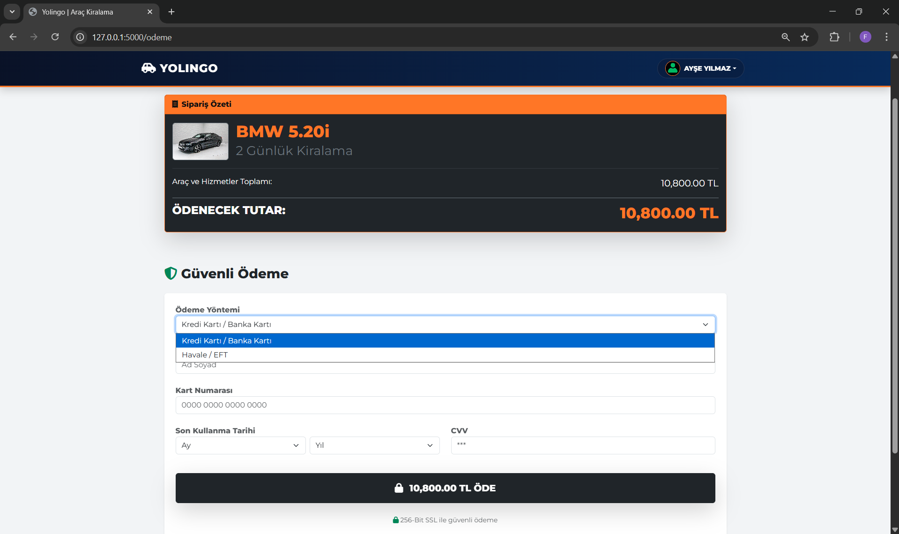 |
| **Müşteri Profil Sayfası** <br> 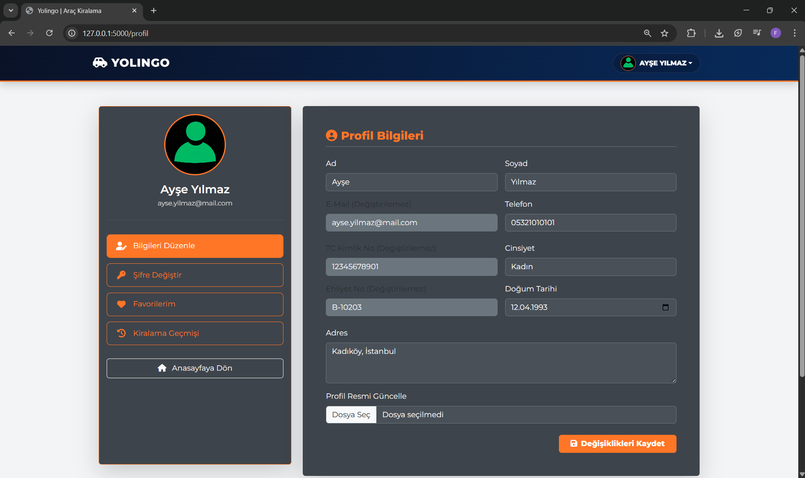 | **Şifre Değiştirme** <br>  |
| **Favori Araçlar** <br>  | **Kiralanan Araçlar (Geçmiş)** <br> 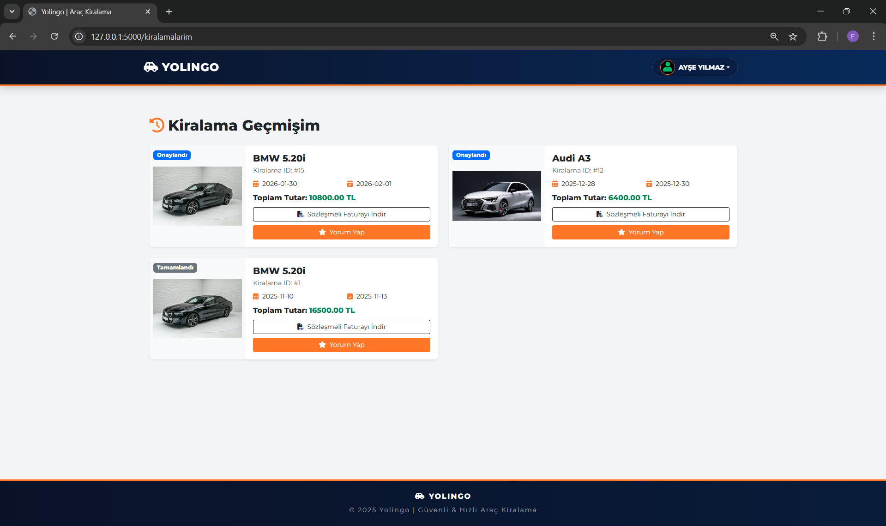 |
| **Sözleşme PDF Örneği** <br> 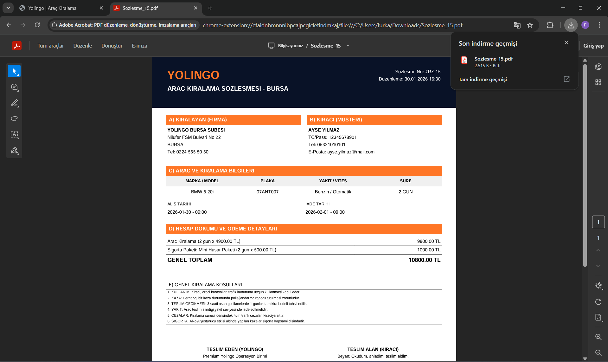 | **Yorum Yapma Formu** <br> 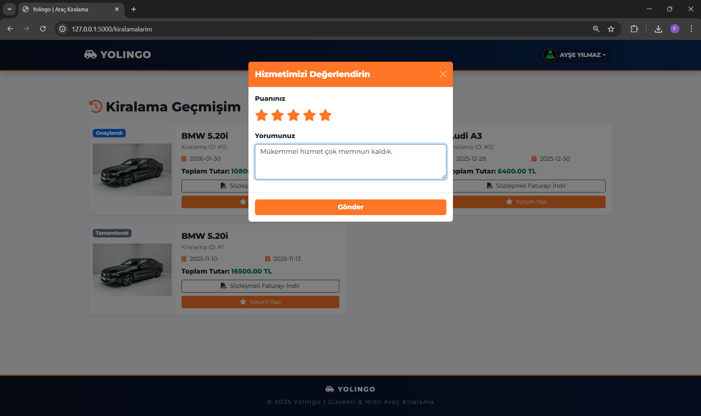 |
| **Yönetici Dashboard** <br> 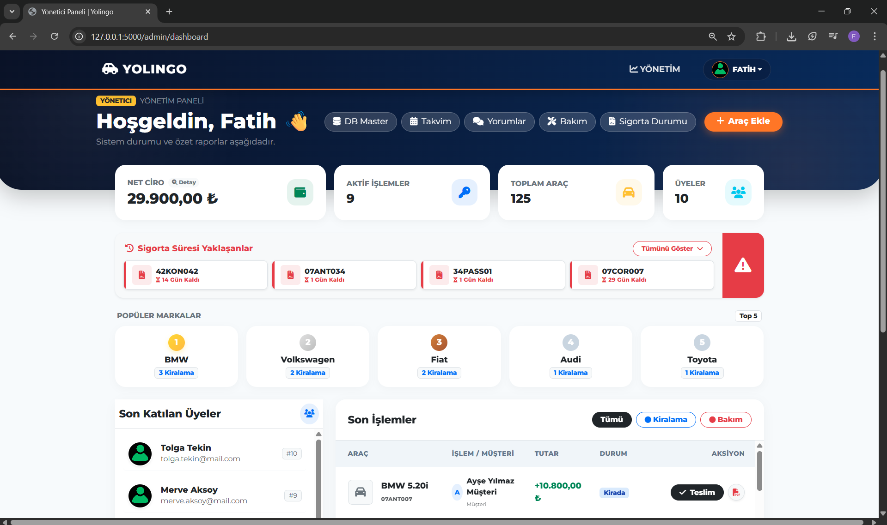 | **Finansal Detaylar** <br>  |
| **Yeni Araç Ekleme** <br> 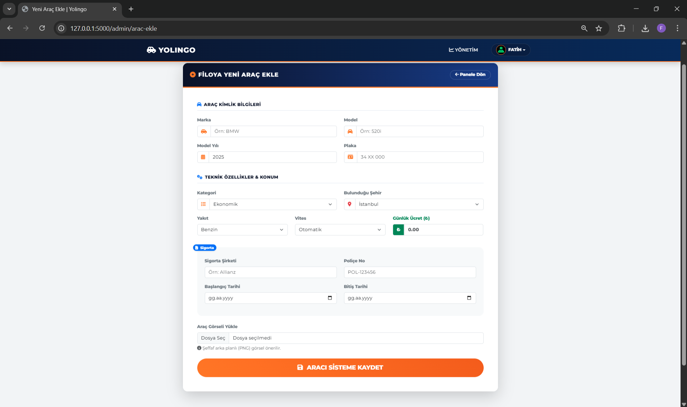 | **Sigorta Yönetimi** <br>  |
| **Bakım Yönetimi (Alma/Çıkarma)** <br> 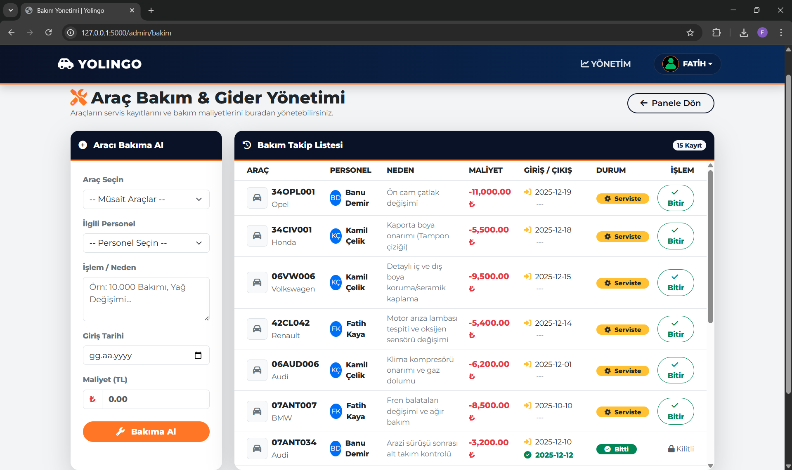 | **Yorum Yönetimi** <br> 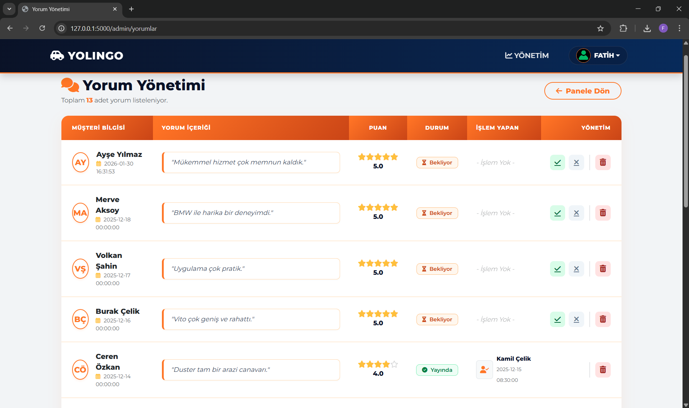 |
| **Kiralama Takvimi** <br> 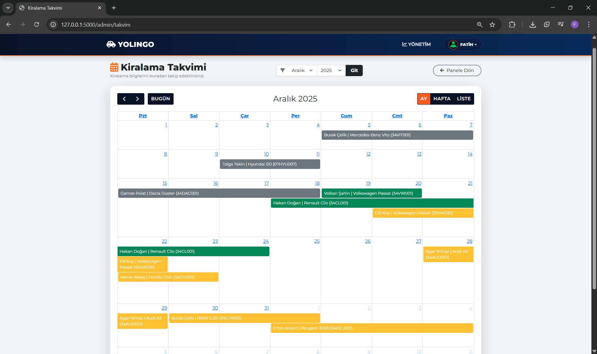 | **Veritabanı Yönetimi** <br> 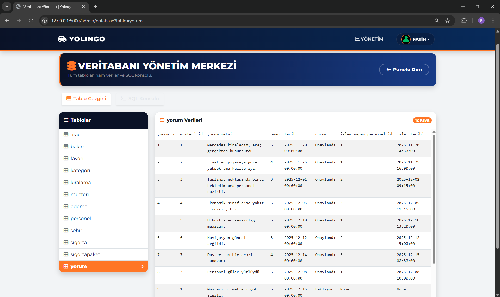 |


---

## 🛠️ Teknolojiler

*   **Backend:** Python 3, Flask (Blueprints yapısı ile modüler mimari)
*   **Veritabanı:** MySQL (Python `mysql-connector` kütüphanesi ile kod üzerinden yönetim)
*   **Frontend:** HTML5, CSS3, Bootstrap 5, JavaScript (ES6)
*   **Kütüphaneler:**
    *   **FPDF2:** Dinamik PDF sözleşme oluşturma
    *   **Chart.js:** Finansal grafikler ve analizler
    *   **FullCalendar:** İnteraktif rezervasyon takvimi
    *   **Flask-Mail:** E-posta bildirimleri (Gmail SMTP)
    *   **SweetAlert2:** Modern bildirim pencereleri


---

## 📂 Proje Dosya Yapısı

Proje, modüler bir yapıda tasarlanmıştır. Her klasörün görevleri aşağıda açıklanmıştır:

```text
flask-yolingo-car-rental/
├── blueprints/             # 🧩 Rota (Route) Dosyaları
│   ├── admin.py            # Admin paneli rotaları
│   ├── auth.py             # Giriş/Kayıt rotaları
│   ├── customer.py         # Müşteri profili rotaları
│   └── rental.py           # Kiralama işlemleri rotaları
│
├── config/                 # ⚙️ Konfigürasyon
│   └── __init__.py         # Uygulama ayarları (Dev/Prod)
│
├── db/                     # 🗄️ Veritabanı İşlemleri
│   ├── admin.py            # Admin işlemleri
│   ├── auth.py             # Yetkilendirme sorguları
│   ├── connection.py       # Veritabanı bağlantısı
│   ├── customers.py        # Müşteri sorguları
│   ├── db.sql              # SQL Yedek dosyası
│   ├── favorites.py        # Favori işlemleri
│   ├── rentals.py          # Kiralama sorguları
│   ├── reviews.py          # Yorum işlemleri
│   ├── schema.py           # Tablo oluşturma komutları
│   ├── seed.py             # Örnek veri ekleme
│   └── vehicles.py         # Araç sorguları
│
├── screenshots/            # 📸 Proje Ekran Görüntüleri
├── static/                 # 🖼️ Statik Dosyalar
│   └── img/                # Görseller (Profil fotoğrafları vb.)
│
├── templates/              # 🎨 HTML Arayüzleri
│   ├── admin/              # Admin paneli sayfaları
│   ├── auth/               # Giriş/Kayıt sayfaları
│   ├── customer/           # Müşteri paneli sayfaları
│   ├── email/              # E-posta şablonları
│   ├── partials/           # Parçalı yapılar (_navbar, _footer vb.)
│   ├── rental/             # Kiralama sayfaları
│   ├── index.html          # Ana sayfa
│   └── layout.html         # Ana şablon (Header/Footer)
│
├── utils/                  # 🛠️ Yardımcı Fonksiyonlar
│   ├── email_utils.py      # Mail gönderme kodları
│   └── file_utils.py       # Dosya işlemleri
│
├── .env                    # 🔒 Gizli Ayarlar (Şifreler vb.)
├── .gitignore              # 🙈 Git Yoksayma Dosyası
├── app.py                  # 🚀 Ana Uygulama Dosyası
└── requirements.txt        # 📦 Gerekli Kütüphaneler
```


---

## 🚀 Kurulum ve Çalıştırma

Projenin bilgisayarınızda çalışması için aşağıdaki adımları izleyin:

1. **Projeyi Klonlayın**
   ```bash
   git clone https://github.com/beytookha/flask-rent-a-car.git
   cd flask-yolingo-car-rental
   ```

2. **Sanal Ortam Oluşturun (Önerilen)**
   ```bash
   # Mac/Linux
   python3 -m venv venv
   source venv/bin/activate

   # Windows
   python -m venv venv
   venv\Scripts\activate
   ```

3. **Gerekli Kütüphaneleri Yükleyin**
   ```bash
   pip install -r requirements.txt
   ```

4. **Veritabanını Hazırlayın**
   
   > **Önemli:** Projenin çalışması için `.env` dosyasını oluşturmayı unutmayın.

   Projeyi ilk kez çalıştırıyorsanız veritabanını oluşturmak için **iki yöntemden birini** seçebilirsiniz:

   **Yöntem 1: SQL Dosyası ile (Önerilen)**
   * `db/db.sql` dosyasını veritabanı yönetim aracınızda (MySQL Workbench vb.) import edin.

   **Yöntem 2: Python Scriptleri ile**
   ```bash
   python db/schema.py  # Tabloları oluşturur
   python db/seed.py    # Örnek araç ve kullanıcı verilerini ekler
   ```

5. **Uygulamayı Başlatın**
   ```bash
   python app.py
   ```
   Tarayıcınızda `http://127.0.0.1:5000` adresine giderek projeyi görüntüleyebilirsiniz.


---

## 🔐 Varsayılan Hesaplar

Veritabanına örnek verileri yüklediyseniz aşağıdaki bilgilerle giriş yapabilirsiniz:


* **👑 Admin Hesabı**  : `admin@yolingo.com / 1234`
* **👤 Müşteri Temsilcisi**  : `mt@yolingo.com / 1234`
* **⚙️ Operasyon Sorumlusu**  : `os@yolingo.com / 1234`


